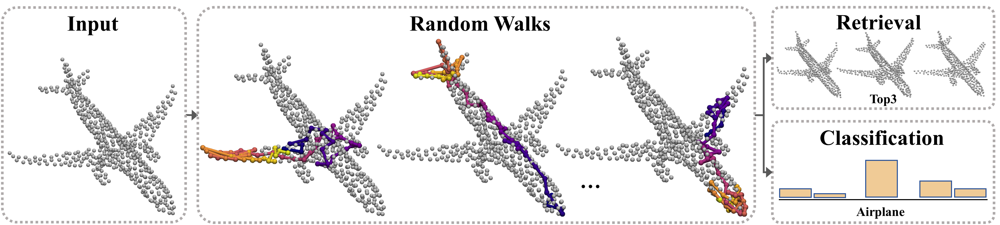

# CloudWalker: Random walks for 3D point cloud shape analysis (SMI 2022)


## [[Paper]](https://arxiv.org/abs/2112.01050)
Created by [Adi Mesika](mailto:adimesika10@gmail.com), Yizhak Ben-Shabat (Itzik) and Ayellet Tal from Technion - Israel Institute of Technology

This repository contains the implementation of CloudWalker

## Installation
The code is tested under tf-2.4.1 GPU version and python 3.8 on Ubunto 18.04, Cuda 11.1, cuDNN v8.0.5, GPU RTX 3090.
There are also some dependencies for a few Python libraries for data processing and visualizations (requirements file).
I suggest you to use Anaconda for creating the virtual environment. 
It is important to install cuda and cudnn before creating the virtual environment. 

For example:
```
conda create -n <env_name> python=3.8
conda activate <env_name>
```
Then, you can install with conda\pip all the packages mentioned in the requirements file.

## Files structure
```
├── CloudWalker
│   ├── datasets_processed
│       ├── modelnet40_normal_resampled (.npz)
│       └── modelnet40_normal_resampled_dirs (pre-created walks)
│   ├── datasets_raw
│       └──  modelnet40_normal_resampled
│   ├── pre_created_walks
│       ├── dataset.py
│       ├── save_walk_as_npz.py
│       └── params_setting.py
│   ├── runs
│   ├── dataset.py
│   ├── dataset_prepare.py
│   ├── evaluate_classification.py
│   ├── evaluate_retrieval.py
│   ├── params_setting.py
│   ├── rnn_model.py
│   ├── train_val.py
│   ├── utils.py
│   ├── requirements.txt
└── └── README.md
```

### Raw datasets
To get the raw datasets go to the relevant website, 
and put it under `CloudWalker/datasets_raw/<dataset>`. 
- [ModelNet](https://shapenet.cs.stanford.edu/media/modelnet40_normal_resampled.zip)
- [3DFuture](https://tianchi.aliyun.com/dataset/dataDetail?spm=5176.14208604.0.0.53c83cf7kHDv5j&dataId=98063) (3D-FUTURE-model.zip).
- [ScanObjectNN](https://hkust-vgd.github.io/scanobjectnn/) (fill out an agreement).


### Processed

This part should be only run once per dataset.  
To prepare the data, run `python dataset_prepare.py <dataset>`

Processing will rearrange dataset in `npz` files. The folder with the files "dataset_processed_tmp" automatically being generated (in root).
Then, copy the generated files for the `<dataset>` to `CloudWalker/datasets_processed/<dataset>`.

The model can be run in two ways. On one, walks that are already prepared, and on the other, walks that are created during training. We decided to release the most efficient version.
It currently requires the walks to be pre-created.

To prepare the walks, run `python pre_created_walks/save_walk_as_npz.py <dataset>`
or download our walks from 
[datasets_processed](https://cgmdata.ece.technion.ac.il/public/data/MesikaCloudWalker/)
to `CloudWalker/datasets_processed/<dataset>`. (dirs version)

## Training
```
python train_val.py <dataset>
```
While `<dataset>` can be one of the following: 
`modelnet40_normal_resampled` / `3dfuture` / `scanobjectnn`.

You will find the results at: `CloudWalker\runs\`

To get the final accuracy results, please refer to the "log.txt" file at `CloudWalker\runs\<trained_model>`, 
or run evaluation script.

## Evaluating
After training is finished (or pretrained is downloaded),
To evaluate **classification** task run: 
```
python evaluate_classification.py <dataset> <trained_model_directory>
```

## Pretrained   
You can use some pretrained models from [our pretrained models](https://cgmdata.ece.technion.ac.il/public/data/MesikaCloudWalker/runs.zip) to run evaluation only.
Download and extract the runs.zip file to the "runs" directory in the root. 
Run the evaluation script as described previously (run on the processed dataset).

For example:
```
python evaluate_classification.py modelnet40_normal_resampled runs/0017-25.05.2022..22.40__modelnet40_normal_resampled
```

## Citation
If you find our work useful in your research, please consider citing:
```
@article{DBLP:journals/corr/abs-2112-01050,
  author    = {Adi Mesika and
               Yizhak Ben{-}Shabat and
               Ayellet Tal},
  title     = {CloudWalker: 3D Point Cloud Learning by Random Walks for Shape Analysis},
  journal   = {CoRR},
  volume    = {abs/2112.01050},
  year      = {2021},
  url       = {https://arxiv.org/abs/2112.01050},
  eprinttype = {arXiv},
  eprint    = {2112.01050},
  timestamp = {Tue, 07 Dec 2021 12:15:54 +0100},
  biburl    = {https://dblp.org/rec/journals/corr/abs-2112-01050.bib},
  bibsource = {dblp computer science bibliography, https://dblp.org}
}
```

## Questions / Issues
If you have questions or issues running this code, please open an issue.
